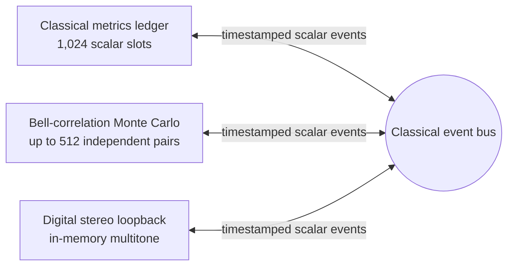

# oes-quantum-binaural-lab — classical toy simulation

[](https://github.com/sparkainlp-x/oes-quantum-binaural-lab/actions/workflows/ci.yml)
[](LICENSE)
[](#scope-and-limitations)
[](#scope-and-limitations)
[](#cite)

Local, dependency-free Python prototype with **three deliberately separate classical software lanes**. The lanes share only timestamped, scalar classical events. “Membrane” is a metaphor; the audio signal is not entangled with qubits. This is a **classical toy simulation** — not quantum hardware, not QEC, and not a consciousness model.

| Lane | Accurate name | What it is **not** |
|---|---|---|
| Control | **Classical metrics ledger** (1,024 scalar slots) | Not an OES detector / OES-32 residual / OES-Resilience score |
| Quantum | **Bell-correlation Monte Carlo model** | Not quantum state or circuit evolution; no QPU |
| Audio | **Digital stereo loopback** | Not analog hardware calibration |

## Run it

Requires Python 3.10 or newer. There are no third-party runtime dependencies.

```bash
git clone https://github.com/sparkainlp-x/oes-quantum-binaural-lab.git
cd oes-quantum-binaural-lab
PYTHONPATH=src python3 -m unittest discover -s tests -v
python3 run_lab.py --json reports/run-report.json
```

To open the interactive local dashboard (loopback only; optional):

```bash
python3 run_lab.py --serve --port 8765
```

Then open <http://127.0.0.1:8765>. The dashboard runs nothing until you click **Run synthetic simulation**. It has no audio playback or device-access code. Press Ctrl+C to stop. Because the dashboard needs the local server, GitHub Pages is not used; the repository URL is the homepage.

Useful command-line controls:

```bash
python3 run_lab.py --pairs 512 --cal-shots-per-state 64 --sweep 4,8,16,32 --seed 1731
python3 run_lab.py --left-level 0.7 --right-level 0.5 --left-phase 0.1 --right-phase -0.25 \
  --delay-samples 5 --crosstalk 0.04 --noise 0.002 --clip-threshold 0.9 --json custom-report.json
```

Bounded limits: 512 pairs (1,024 qubits in the naming sense only), 128 evaluation shots per pair per setting, and 4,096 calibration shots per known prepared pair outcome. Default calibration uses 64 shots for each of four known pair preparations per modeled pair. Default evaluation sweep is 4, 8, and 16 shots per pair per setting.

## Architecture



The three implementation lanes (`quantum.py`, `audio.py`, `control.py`) do not import one another. `app.py` orchestrates them and projects only numeric reported metrics through `bus.py`. Event payloads reject arrays and other non-scalar objects; string fields are short label strings (max 64 chars, restricted charset), so quantum states, measurement samples, and audio waveforms cannot cross the boundary as arrays or serialized blobs.

## Bell-correlation Monte Carlo and calibration

The default structured model is **512 independent pairwise samplers (1,024 named qubits total)**. It is not one globally entangled 1,024-qubit state. Each pair is sampled using a four-outcome probability distribution from a stipulated cosine correlation law with synthetic readout error; the implementation never constructs a dense state vector of size `2^1024`, and it does **not** prepare or evolve a quantum state or circuit. Classical Monte Carlo only.

Superposition tooling includes repeated Z-basis measurements of `|+> = (|0> + |1>)/sqrt(2)` (a balanced-outcome sampler) plus an **H-then-Z control**: ideal `|+>` yields P(1)=0 after H, while an incoherent 50/50 mixture stays ~50/50. The observer is measurement/readout in the model, not consciousness.

### Pair-local readout assignment matrices

Readout is modeled with **one 4×4 assignment matrix per Bell pair**. Hidden true per-pair matrices generate **evaluation** shots; calibration estimates (and the pooled aggregate) are used **only for correction**. Calibration shots are not reused as evaluation shots.

For aggregate metrics, the prototype pools the pair-specific calibration counts, applies a bounded 4×4 linear correction, and Euclidean-projects onto the probability simplex. Corrected correlation and CHSH 95% intervals use an analytic normal approximation to the unprojected linear-deconvolution shot variance, aggregating **unbounded** component standard errors (component display intervals may still be clipped to [-1, 1]). They do not account for projection effects or propagate matrix-estimation uncertainty.

### CHSH labeling

Ideal correlation `E(a,b) = cos(2(a-b))`. Any CHSH number here is an **approximate simulated protocol check only**—not a loophole-free Bell test, not a physical Bell test, and not hardware evidence. Finite-sample noise and simplex projection can push the corrected point slightly above `2√2`; that is a simulator artifact, not a physical claim. No quantum advantage is claimed.

Bundled default-run (seed 1731, final 16-shot sweep): raw CHSH ≈ 2.526; corrected CHSH ≈ 2.838 with conditional 95% interval overlapping `2√2 ≈ 2.828`. See [`reports/default-run-summary.md`](reports/default-run-summary.md).

## Digital stereo loopback

This lane generates an original two-channel digital multitone signal in memory. Unsafe frame/delay combinations that alias phase unwrapping (for example 1,024 frames with a 64-sample delay) are rejected with a clear error. When either channel level is zero, crosstalk for that direction is reported as unavailable (`null`) rather than a misleading number.

This is **digital stereo loopback**, not an analog measurement. It does not open an audio device.

## Review fixes in v0.1.0

1. **Calibration independence** — evaluation shots come from hidden true per-pair matrices; only estimates correct. Repeated-seed coverage test as calibration shots vary.
2. **`|+>` coherence control** — H-then-Z arm: ideal `|+>` → P(1)=0; mixture stays ~50/50 (plus test).
3. **CHSH intervals** — aggregate unbounded component standard errors (no clip-then-combine); low-shot regression test; corrected value labeled approximate simulator check (may exceed `2√2` from finite-sample/projection effects).
4. **Audio safety** — reject aliasing frame/delay combos; zero-level crosstalk → `null` (plus tests).
5. **Event bus strings** — short label pattern/length limit so serialized arrays cannot cross as text (plus test).
6. **Naming** — classical metrics ledger / Bell-correlation Monte Carlo / digital stereo loopback; all classical-toy and no-advantage disclaimers retained.
7. **Bundled reports** — regenerated from fixed code with seed 1731.

## Scope and limitations

- Classical toy simulation / SYNTHETIC evidence only.
- “Membrane” is metaphorical; no biological membrane is represented.
- “Observer” means measurement/readout; no consciousness detection is modeled.
- No quantum hardware, no quantum state/circuit evolution, no QEC, no quantum advantage.
- Pair-local 4×4 readout crosstalk is simulated; cross-pair correlated readout is not.
- CHSH is an approximate simulator check, not a loophole-free Bell test or hardware evidence.
- Digital stereo loopback only; analog hardware calibration is not included.
- The optional dashboard binds to loopback only.

## Cite

See [`CITATION.cff`](CITATION.cff). DOI pending Zenodo (do not mint a GitHub release until the webhook is enabled).

## License

AGPL-3.0-only. Commercial licensing: [`COMMERCIAL-LICENSE.md`](COMMERCIAL-LICENSE.md).
